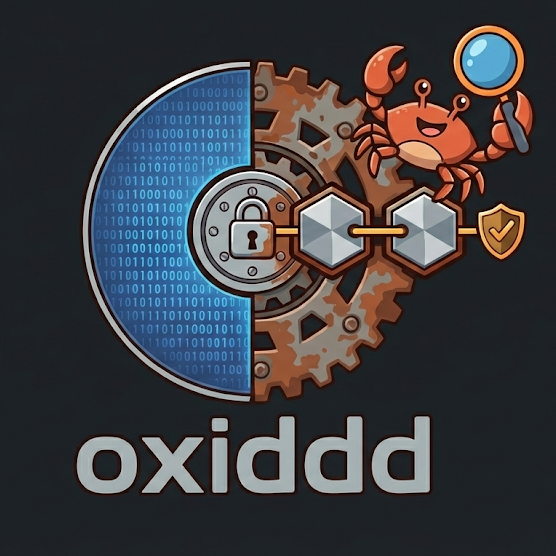

# oxiddd

[](https://github.com/jolanallen/oxiddd/actions/workflows/ci.yml)
[](https://www.gnu.org/licenses/gpl-3.0)

**oxiddd** est un outil d'acquisition de données disque haute performance conçu pour l'investigation numérique (forensics). Développé en Rust, il se présente comme une alternative moderne, sécurisée et optimisée à l'outil classique `dc3dd`.

## Caractéristiques principales

*   **Performance optimisée** : Architecture de pipeline multi-threadée avec gestion de pool de tampons alignés (zero-copy).
*   **Accès Direct aux E/S** : Utilisation du flag `O_DIRECT` sous Linux pour contourner le cache du noyau, garantissant un débit stable et une interaction directe avec le matériel.
*   **Intégrité Forensic Liée (Binding)** : Méthode de hachage exclusive liant le contenu binaire, le nom du fichier de destination et l'horodatage précis dans une signature unique.
*   **Horodatage NTP Certifié** : Récupération de l'heure exacte via les serveurs NTP de Google pour prévenir toute altération de l'horloge système locale.
*   **Double Hachage Simultané** : Génération automatique d'un hash standard (copie bit-à-bit pour compatibilité Autopsy/EnCase) et d'un hash forensic bindé.
*   **Autonome et Statique** : Compilation en binaire statique sans dépendances dynamiques pour une utilisation sur des systèmes compromis.

## Installation

### Prérequis
*   Rust (dernière version stable)
*   `musl-tools` (pour les builds statiques Linux)

### Compilation
```bash
cargo build --release
```

### Build Statique (Usage Incident Response)
```bash
./build_static.sh
```

## Utilisation

L'outil supporte la syntaxe standard des drapeaux CLI (recommandée pour l'autocomplétion) ainsi que la syntaxe historique `dd`.

### Syntaxe Standard
```bash
sudo ./oxiddd --if /dev/sdb --of acquisition.dd --hash sha256
```

### Syntaxe DD
```bash
sudo ./oxiddd if=/dev/sdb of=acquisition.dd hash=sha512 bs=8M
```

## Algorithme d'Intégrité

À la différence des outils standards, `oxiddd` calcule une signature globale :
`SHA256( Contenu_Disque + Nom_Fichier_Cible + Timestamp_NTP )`

Cette approche garantit que si l'image est renommée ou si les métadonnées de temps sont modifiées, le hash forensic ne correspondra plus, assurant ainsi une chaîne de possession inviolable.

## Licence

Ce projet est distribué sous licence **GPL-3.0**. Voir le fichier `LICENSE` pour plus de détails.
