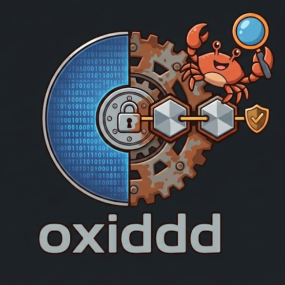

# oxiddd

[](https://github.com/jolanallen/oxiddd/actions/workflows/ci.yml)
[](https://www.gnu.org/licenses/gpl-3.0)

**oxiddd** est un outil d'acquisition de données disque haute performance conçu pour l'investigation numérique (forensics). Développé en Rust, il se présente comme une alternative moderne, sécurisée et optimisée à l'outil classique `dc3dd`.

## Caractéristiques principales

*   **Mode Interactif Intuitif** : Lancez l'outil sans arguments pour accéder à un assistant guidé avec détection automatique des disques.
*   **Performance optimisée** : Architecture de pipeline multi-threadée avec gestion de pool de tampons alignés (zero-copy).
*   **Accès Direct aux E/S** : Utilisation du flag `O_DIRECT` sous Linux pour contourner le cache du noyau, garantissant un débit stable et une interaction directe avec le matériel.
*   **Double Copie Parallèle** : Possibilité de créer simultanément une **Master Copy** (pour les scellés) et une **Working Copy** (pour l'analyse) en une seule lecture disque.
*   **Intégrité Forensic Liée (Binding)** : Méthode de hachage exclusive liant le contenu binaire, le nom du fichier de destination et l'horodatage précis dans une signature unique.
*   **Horodatage NTP Certifié** : Récupération de l'heure exacte via les serveurs NTP de Google pour prévenir toute altération de l'horloge système locale.
*   **Vérification Post-Écriture** : Option de relecture intégrale pour valider l'intégrité bit-à-bit des images générées.
*   **Autonome et Statique** : Compilation en binaire statique sans dépendances dynamiques pour une utilisation sur des systèmes compromis.

## Installation

### Via Cargo (Recommandé)
Si vous avez Rust installé sur votre système :
```bash
cargo install oxiddd
```

### Prérequis pour la compilation manuelle
*   Rust (dernière version stable)
*   `musl-tools` (pour les builds statiques Linux)

### Compilation
```bash
cargo build --release
```

### Build Statique (Usage Incident Response)
```bash
./build_static.sh
```

## Utilisation

L'outil supporte un mode interactif (sans arguments) ainsi que la syntaxe CLI standard.

### Mode Interactif (Recommandé pour éviter les erreurs)
```bash
sudo ./oxiddd
```

### Syntaxe Standard
```bash
# Acquisition simple avec vérification
sudo ./oxiddd --if /dev/sdb --of acquisition.dd --hash sha256 --verify

# Création d'une copie Maître et d'une copie de Travail
sudo ./oxiddd --if /dev/sdb --of affaire_001 --working-copy --verify
```

### Syntaxe DD
```bash
sudo ./oxiddd if=/dev/sdb of=acquisition.dd hash=sha512 bs=8M verify=true working-copy=true
```

## Algorithme d'Intégrité

À la différence des outils standards, `oxiddd` calcule une signature globale :
`SHA256( Contenu_Disque + Nom_Fichier_Cible + Timestamp_NTP )`

Cette approche garantit que si l'image est renommée ou si les métadonnées de temps sont modifiées, le hash forensic ne correspondra plus, assurant ainsi une chaîne de possession inviolable.

## Licence

Ce projet est distribué sous licence **GPL-3.0**. Voir le fichier `LICENSE` pour plus de détails.
